<p align="center">
  <picture>
    <source media="(prefers-color-scheme: dark)" srcset="public/brand/lockup-dark.svg">
    
  </picture>
</p>

<p align="center">
  A shared database portal for SRE, DevOps and developers.<br>
  One deployment. One set of datasources. Every execution attributed to a person.
</p>

<p align="center">
  <a href="https://github.com/klinux/dbportal/actions/workflows/ci.yml"></a>
  <a href="LICENSE"></a>
</p>

---

One deployment, one set of datasources, single sign-on, and an audit trail of
**every** execution — so nobody needs a database password, a bastion host, or
Adminer, and every statement that reaches a database is attributable to a person.

> dbportal started as a snapshot of [LibreDB Studio](https://github.com/libredb/libredb-studio)
> 0.16.0 (MIT) with the packaging and distribution machinery removed; the editor, the 16
> database drivers and SSO come from there ([NOTICE.md](NOTICE.md)). The governance,
> operations and scale layers described below were built on top, and
> [docs/CONTEXT.md](docs/CONTEXT.md) §4 records the design of each and what was
> deliberately left out. Current release: [0.3.0](https://github.com/klinux/dbportal/releases).

## Why

Teams that run databases end up with the same shape of problem:

- **Production**: SRE/DevOps need to run operational tasks (kill sessions, vacuum,
  inspect, fix data) and each one has to be auditable.
- **Staging**: developers need real power — `DELETE`, `DROP`, dumps — without a
  shared password floating around in a chat.
- **Both**: datasources should be configured **once**, centrally, with the
  credentials injected from a secrets manager, never typed by a person.

Web IDEs solve the editor part. Access proxies solve the audit part. dbportal
is the one thing you deploy that does both for the browser use case, and it
runs the bots' and agents' requests through the same rules.

## The editor (inherited)

- Browser SQL IDE (Monaco) with schema explorer, ER diagrams, schema diff,
  EXPLAIN, charts, monitoring dashboard and maintenance actions.
- 16 engines: PostgreSQL, MySQL, Oracle, SQL Server, SQLite, libSQL, DuckDB,
  MongoDB, Redis, Couchbase, ClickHouse, Druid, Elasticsearch, OpenSearch,
  Trino, Cassandra — plus wire-compatible relatives (MariaDB, TimescaleDB,
  CockroachDB, Valkey, ScyllaDB, …).
- OIDC single sign-on (Keycloak, Okta, Entra ID, Auth0, …) with role mapping
  from claims; local accounts with TOTP as the fallback.
- SSL/TLS and SSH tunnels for every networked engine.

## What dbportal adds

**Datasources, declared once.** Created by administrators only — in a YAML file or on
the admin page — stored server-side and shared; no route accepts a connection from the
browser. Credentials come from `${ENV}` references or from HashiCorp Vault (`vault:kv:`
static secrets, `vault:db:` a credential issued per person with a lease), picked from a
searchable list, never typed. SSH bastions declared once as profiles. Environments
(production, staging, …) an administrator keeps.

**Who may do what.** Access rules per datasource: `roles` (who may open), `writeRoles`
(who may write), `exportRoles`, with `group:<name>` principals from the identity
provider and named roles declared once. Read-only sessions get a read-only pool.
`application_name` per person on every database session, so the database's own logs
name who, not the shared role. Short sessions renewed in use.

**Every execution governed and audited.** One audit line per execution — person,
datasource, duration, outcome, the statement under `AUDIT_INCLUDE_SQL` — as structured
stdout and in an append-only table nobody can clear; read a page at a time, shipped to
Elasticsearch, pruned by age. Write approvals with one or two reviewers, from the portal
or from Slack's buttons. Guardrails (a `DELETE` without `WHERE`, a `DROP`, a `TRUNCATE`
wait for a reviewer), limits per datasource (rows, timeout, concurrency), freeze windows,
a ticket reference required where the datasource says so. Server-side masking, with a
reveal granted per role and audited. Exports by rule, built and masked on the server.

**Operations.** Runbooks: one statement declared once per datasource, run from a form.
Backups with `pg_dump` (restore outside production; production dumps copied to a
bucket). Seeds: a staging datasource filled from its schema with generated rows, or
with a masked sample of another datasource. Alerts: a read on a schedule with a
condition, fired to Slack channels picked by name or to webhooks; and alerts on the
trail itself (a guardrail trip, an export off production, a failed backup).

**Virtual datasources.** Two to eight PostgreSQL or MySQL datasources of the same
environment opened as one, so a statement joins `orders.public.pedidos` with
`crm.crm.clientes`: read-only for everyone, open to whoever may open every member, each
member resolved with that person's own credentials, joined in an embedded engine session
that runs in a process of its own and is locked once the members are attached.

**Bots and agents, apart.** A bot API (`/api/v1/executions`) where a bot asks, a
reviewer approves, the server runs and POSTs the outcome to a signed callback; an MCP
endpoint for troubleshooting agents; both served by an `agent` role that answers only
those two surfaces.

**Built to run several of each.** Executions, alerts, seeds, exports and backups run
through a job queue in the store, consumed by `worker` pods that scale on the queue's
depth (KEDA); several studio replicas elect one alert-scheduler leader through a lease
in the store; a Jobs page watches all of it. Liveness and readiness probes, a
Prometheus exposition of the portal itself, a signed image with SBOM and provenance.
[docs/ARCHITECTURE.md](docs/ARCHITECTURE.md) §7 draws the topology.

Deliberately **out of scope**: desktop apps, marketplace listings, npm library
packaging.

## Screenshots

| Sign-in | Studio |
| --- | --- |
| 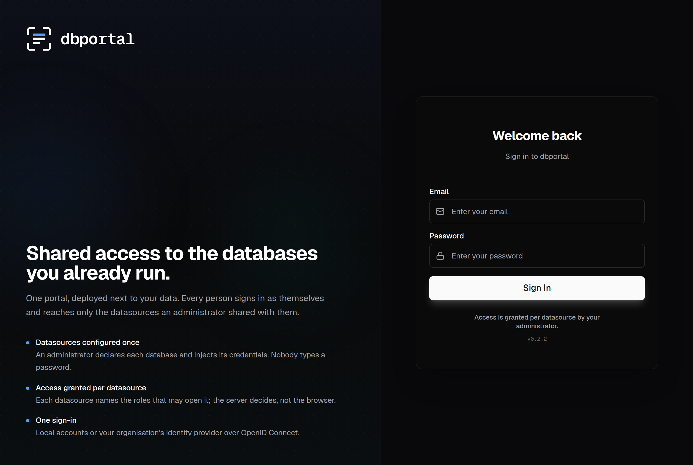 | 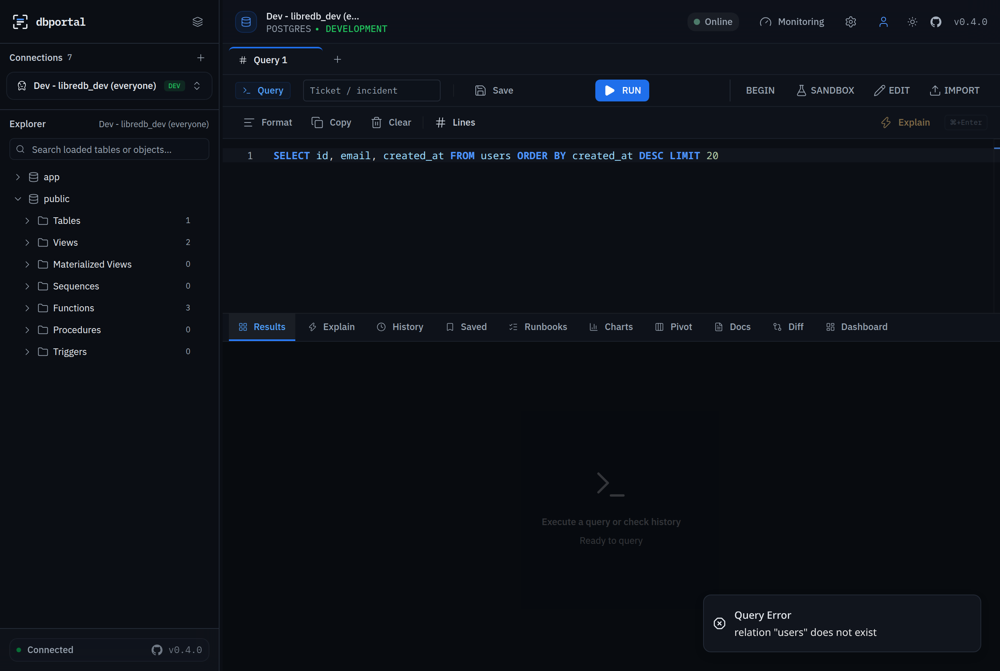 |

| Admin · Overview | Admin · Datasources |
| --- | --- |
| 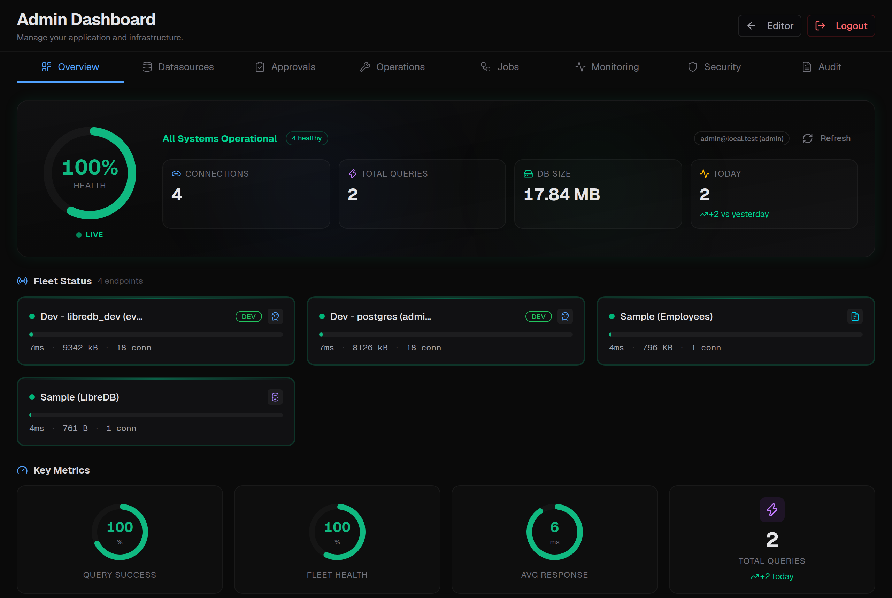 | 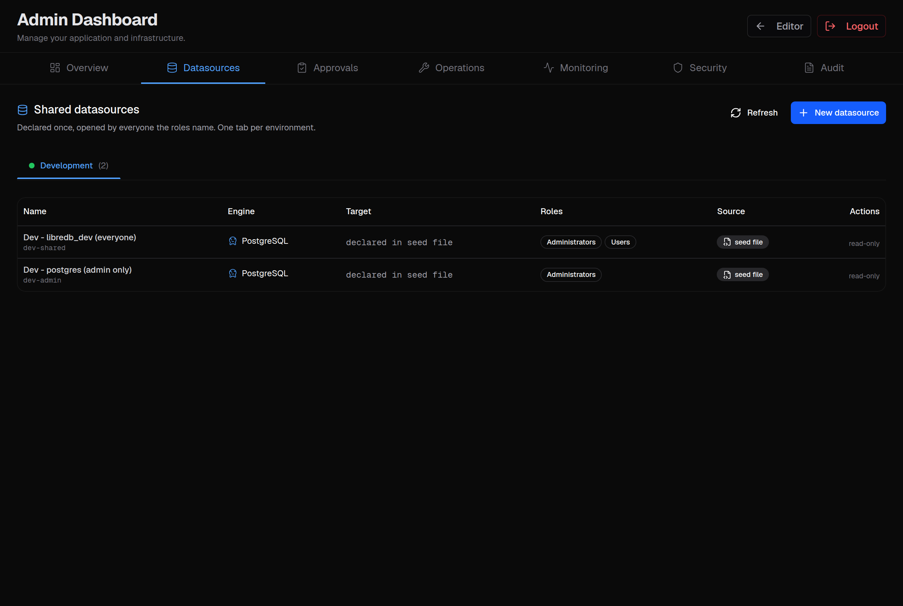 |

| Datasource sheet | Admin · Approvals |
| --- | --- |
| 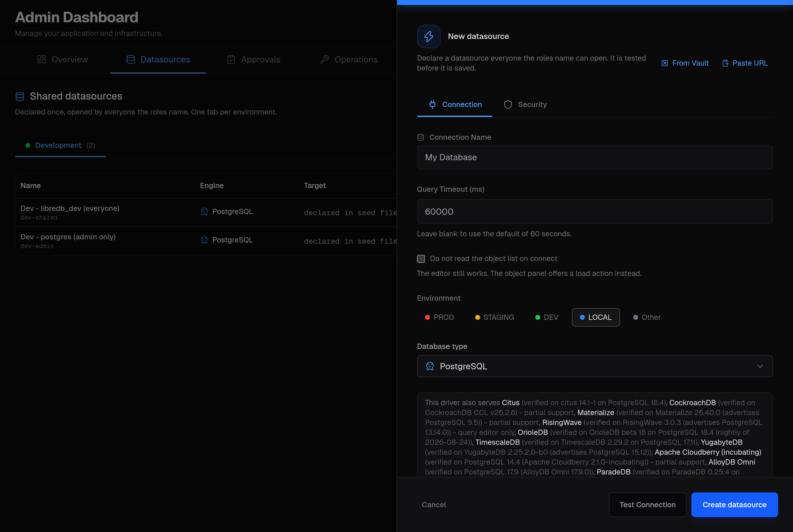 | 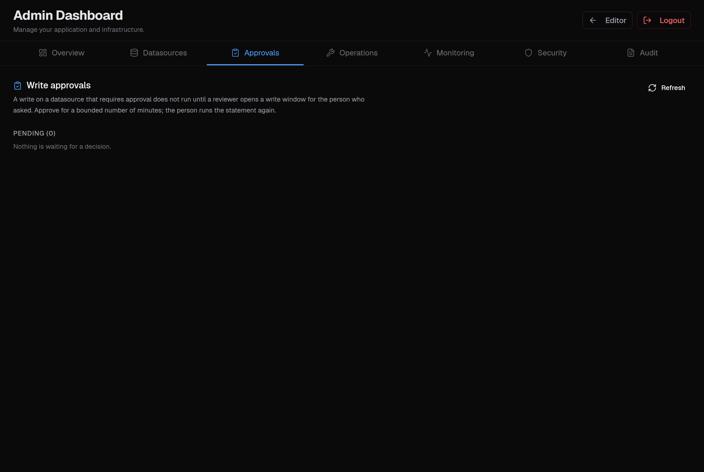 |

| Admin · Operations | Admin · Operations · Backups |
| --- | --- |
| 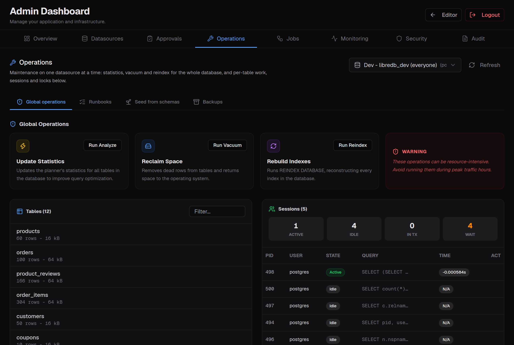 | 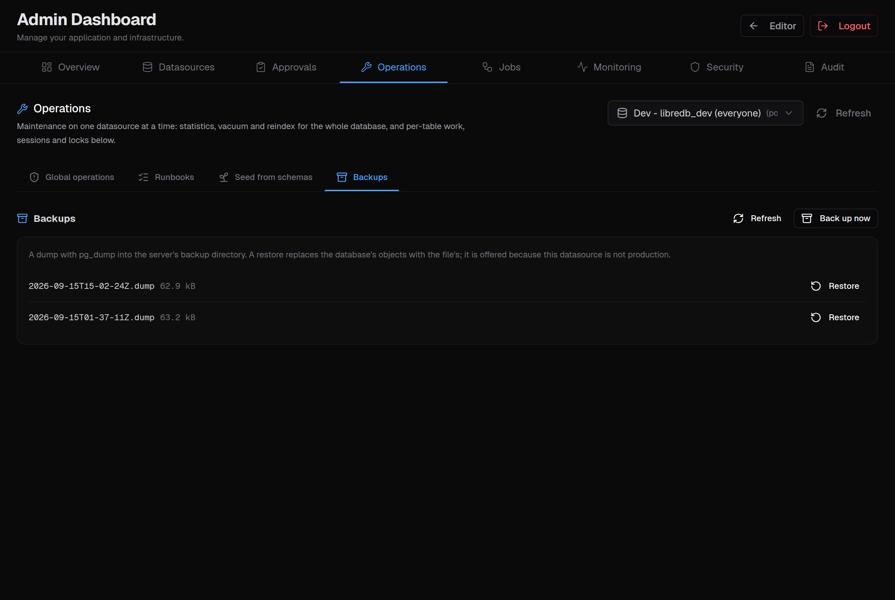 |

| Admin · Jobs | Admin · Monitoring |
| --- | --- |
| 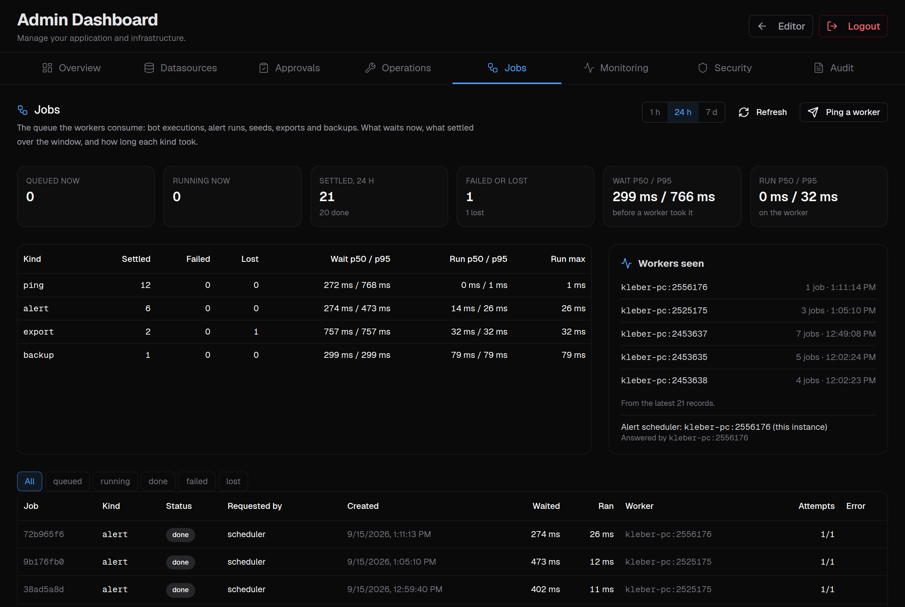 | 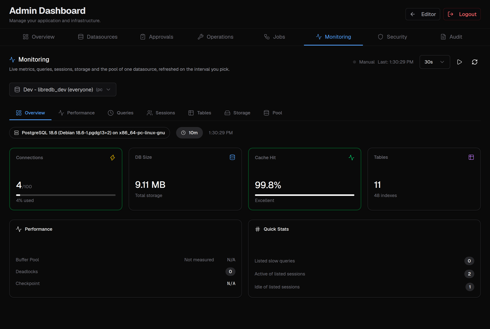 |

| Admin · Security | Admin · Audit |
| --- | --- |
| 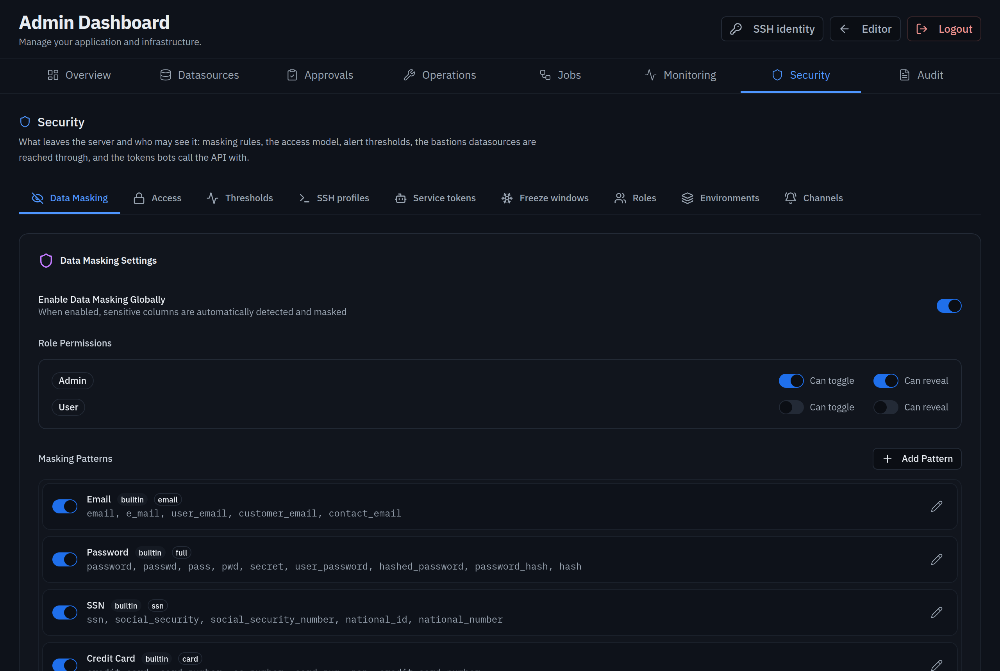 | 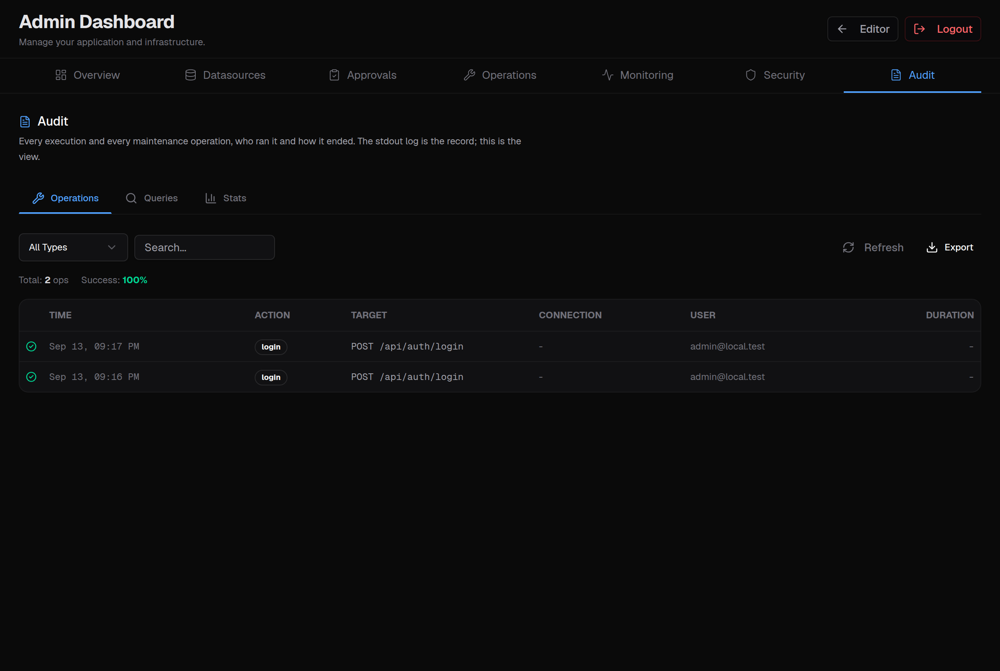 |

| Alerts | Alerts · Channels |
| --- | --- |
| 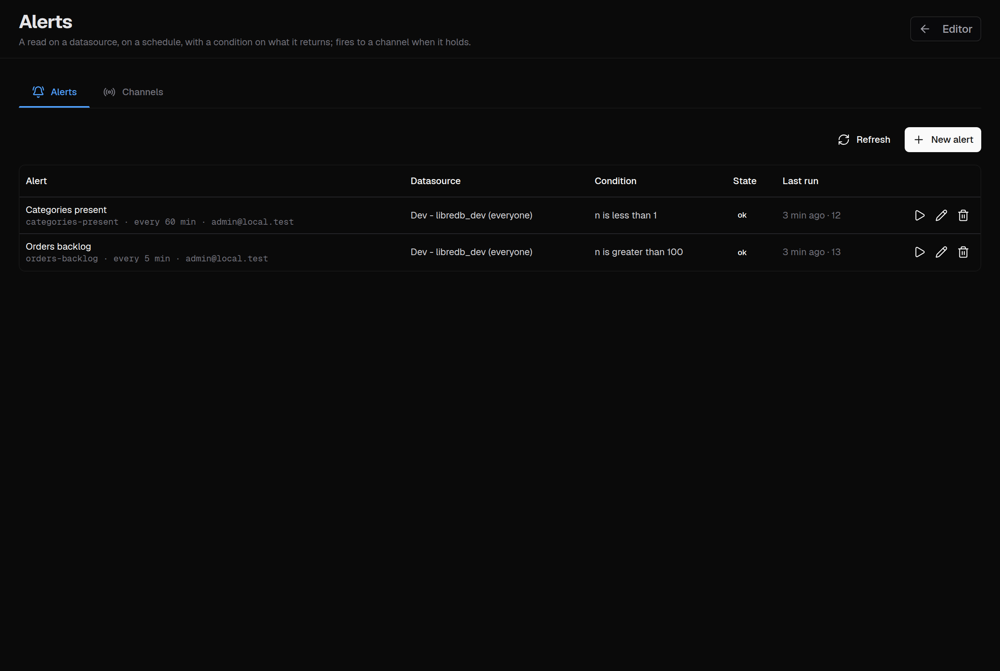 | 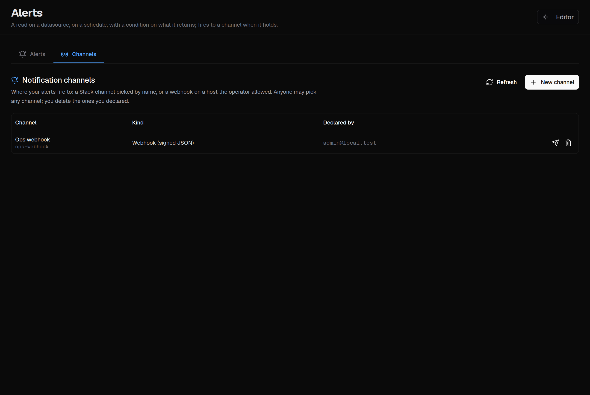 |

Regenerate them against a running server with `node scripts/screenshots.mjs`
(see the header of that script for the variables it reads).

## Quick start

```bash
cp .env.example .env          # set JWT_SECRET, ADMIN_PASSWORD at least
docker compose up -d          # http://localhost:3000
```

Or for development (PostgreSQL in Docker as both the dev database and the server store,
the app under `bun run dev`):

```bash
bun install
make env          # .env.local from the example; set JWT_SECRET and ADMIN_PASSWORD
make dev          # database up, app on http://localhost:3000 (Ctrl+C stops the app)
make stop         # app and database down
```

`make help` lists the rest (`dev-bg`, `db-reset`, `status`, `check`, `test`, `coverage`).

Operators: [docs/OPERATOR_GUIDE.md](docs/OPERATOR_GUIDE.md), from an empty cluster to a team.
Kubernetes: [charts/dbportal](charts/dbportal) (three studios, workers scaled on the queue,
the agent apart: the chart README) and [docs/HELM_CHART.md](docs/HELM_CHART.md).
Topology: [docs/ARCHITECTURE.md](docs/ARCHITECTURE.md) §7.
Managed datasources: [docs/SEED_CONNECTIONS.md](docs/SEED_CONNECTIONS.md).
SSO: [docs/OIDC.md](docs/OIDC.md). API: [docs/API_DOCS.md](docs/API_DOCS.md).

## Development

```bash
make check          # lint + typecheck
make test           # the suite the way CI runs it
make coverage       # the 100% line-coverage gate
bun run lint        # oxlint + eslint
bun run typecheck
bun run test:unit   # fast, no databases needed
bun run test:ci     # full core + component suites (per-file isolation)
docker compose -f database-compose.yml up -d && bun run test:integration
```

## Brand

The mark, lockups and colour system live in [public/brand/](public/brand/) and are
specified in [docs/DESIGN.md](docs/DESIGN.md). The wordmark is always lowercase
IBM Plex Mono; the three status colours describe execution outcomes only.

## License

MIT — see [LICENSE](LICENSE) and [NOTICE.md](NOTICE.md).
