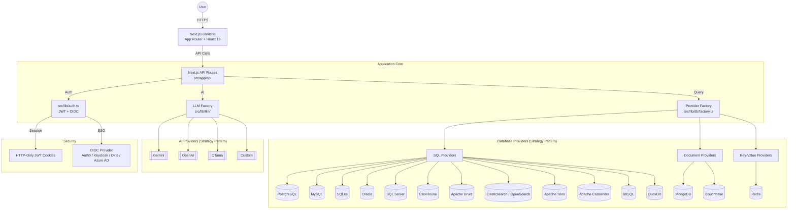
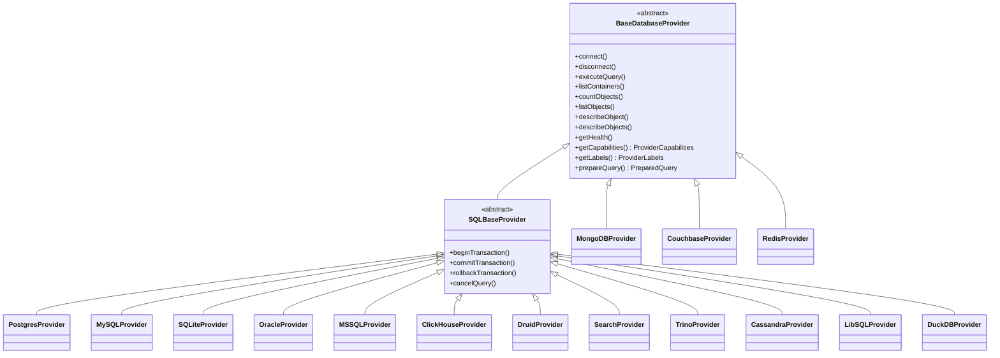
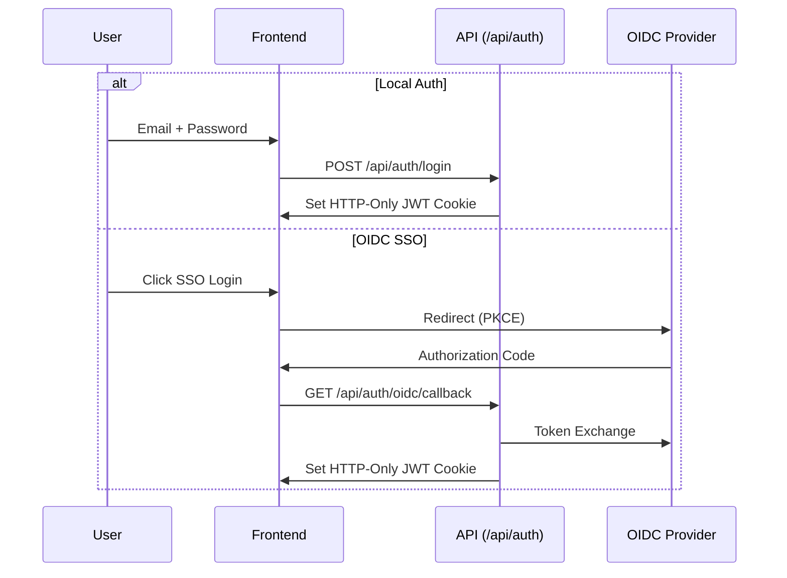
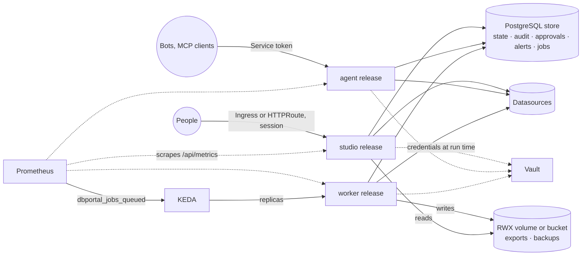

# High-Level Architecture - dbportal

This document outlines the architectural patterns, tech stack, and system design for dbportal, a web-based SQL IDE for cloud-native teams.

## System Overview

dbportal is a hybrid, cloud-native database management tool that provides an IDE-like experience in the browser. It supports **17 database backends** via a Strategy Pattern abstraction: PostgreSQL, MySQL, SQLite, libSQL, DuckDB, Oracle, SQL Server, MongoDB, Couchbase, ClickHouse, Apache Druid, Apache Trino, Apache Cassandra, Elasticsearch, OpenSearch, Redis, LibreDB. The count is the `SHIPPED` record in [`src/lib/db/compatibility.ts`](../src/lib/db/compatibility.ts), which is exhaustive over `DatabaseType`; `elasticsearch` and `opensearch` are two ids served by one provider module.

It runs as a **standalone Next.js app** — one process serving the UI and the API. The upstream snapshot also shipped as an embeddable npm package; that build was removed (see [docs/CONTEXT.md §6](CONTEXT.md)), and what remains of it is described in [§4.6](#46-workspace-abstraction).

## 1. Core Tech Stack

| Layer | Technology |
|-------|-----------|
| Framework | Next.js 16 (App Router) with React 19 |
| Runtime | Bun / Node.js |
| Language | TypeScript (strict mode) |
| Styling | Tailwind CSS 4 + Shadcn/UI |
| Animations | Framer Motion v13 |
| SQL Editor | Monaco Editor |
| Data Grid | TanStack React Table + react-virtual |
| AI | Multi-model (Gemini, OpenAI, Ollama, Custom) |
| Auth | JWT (`jose`) + OIDC SSO (`openid-client`) |
| Charts | Recharts |
| Containerization | Docker (multi-stage Bun build) |

## 2. High-Level Architecture Diagram



## 3. Database Provider Architecture



Each provider implements:
- **`getCapabilities()`** - queryLanguage, supportsExplain, supportsCreateTable, maintenanceOperations, etc.
- **`getLabels()`** - entityName, selectAction, searchPlaceholder, etc. (drives all UI text)
- **`prepareQuery()`** - handles query limiting per-provider (SQL LIMIT injection vs MongoDB native)

Adding a new database type requires: **1 provider class** + **1 entry in `db-ui-config.ts`**.

`CouchbaseProvider` extends `BaseDatabaseProvider` even though SQL++ is a SQL dialect: SQL++ quotes identifiers with doubled backticks, which `escapeIdentifier()` produces for no existing type, so it owns its quoting and declares its SQL-ness through `queryLanguage: 'sql'` instead. Being reached over HTTP is **not** the reason — `ClickHouseProvider`, `DruidProvider` and `TrinoProvider` add no driver either, and all three extend `SQLBaseProvider`, because double-quoted identifiers are correct in each dialect. Each driver-free provider is a directory rather than a single file, with its wire format behind a transport seam that provider logic never bypasses. Trino inherits everything except the limiter: its grammar is `[ OFFSET count ] [ LIMIT count ]` and only that way round, so `prepareQuery()` transposes the clause the shared limiter emits. See [`docs/providers/couchbase.md`](providers/couchbase.md), [`clickhouse.md`](providers/clickhouse.md), [`druid.md`](providers/druid.md) and [`trino.md`](providers/trino.md).

## 4. Key Architectural Patterns

### 4.1. Strategy Pattern (Database & LLM)

Both database and LLM layers use the Strategy Pattern with a factory:
- `src/lib/db/factory.ts` - Creates the correct database provider based on connection type
- `src/lib/llm/factory.ts` - Creates the correct LLM provider based on configuration

No `isMongoDB` / `=== 'mongodb'` checks outside provider classes. All behavior differences are driven through capabilities and labels.

### 4.2. Authentication Flow



Controlled by `NEXT_PUBLIC_AUTH_PROVIDER` (`local` | `oidc`). Both flows result in the same JWT session cookie. Proxy (`src/proxy.ts`) enforces RBAC (admin vs user roles).

### 4.3. Multi-Statement Execution

`src/lib/sql/statement-splitter.ts` splits SQL input into individual statements, handling:
- String literals (single/double quotes)
- Block and line comments
- Dollar-quoting (PostgreSQL)

Multi-statement queries execute sequentially via `POST /api/db/multi-query`.

### 4.4. Storage Abstraction Layer

- **Write-through cache architecture**: localStorage (L1 cache) + optional server storage (L2 persistent)
- **Three storage modes** controlled by `STORAGE_PROVIDER` env var:
  - `local` (default): Browser localStorage only, zero configuration
  - `sqlite`: Server-side SQLite file via `better-sqlite3`
  - `postgres`: Server-side PostgreSQL via `pg`
- **`useStorageSync` hook** in Studio.tsx: discovers mode at runtime via `/api/storage/config`, pulls on mount, pushes mutations (debounced 500ms)
- **Migration**: First login auto-migrates localStorage to server; `libredb_server_migrated` flag prevents re-migration
- **Graceful degradation**: If server unreachable, localStorage continues working

### 4.5. Client State Management

- **Storage module** (`src/lib/storage/`) for persistent data: connections, query history, saved queries, schema snapshots, chart configs, audit log, masking config, threshold config
- **React hooks** for UI state: tabs, active connection, execution status
- **Custom hooks** extracted from Studio.tsx: `useAuth`, `useConnectionManager`, `useTabManager`, `useTransactionControl`, `useQueryExecution`, `useInlineEditing`

### 4.6. Workspace Abstraction

The upstream project shipped the studio as an embeddable npm package; the snapshot removed that build (`tsup`, `tsconfig.lib.json`, the `exports` map — [docs/CONTEXT.md §6](CONTEXT.md)). Two pieces of its shape remain, because tests reference them and they cost nothing:

- **`src/workspace/`** — `StudioWorkspace.tsx`, a shell whose adapter hooks (`hooks/use-connection-adapter`, `hooks/use-query-adapter`) let a host supply connections and query execution. Only the standalone app uses it today.
- **`src/exports/`** — barrel modules (`components.ts`, `providers.ts`, `workspace.ts`, `types.ts`). Nothing publishes them; they can go with the UI/API split.
- **`src/styles/theme.css`** — the semantic colour tokens the UI resolves through. See [`docs/ui/theming.md`](ui/theming.md).

### 4.7. Standalone Boot Flow (`src/instrumentation.ts`)

Next.js runs `register()` once per server worker, only on the Node.js runtime. On boot it:

1. **Bootstraps missing auth env** (`src/lib/auth-bootstrap.ts`, #109). When `JWT_SECRET` / `ADMIN_PASSWORD` are absent they are generated once, persisted to `<data dir>/auth-bootstrap.json` (mode `0600`), and injected into `process.env` before any secret reader runs; the admin password is printed once. Explicitly set env vars always win. Disable with `AUTH_BOOTSTRAP=off|false|0` (case-insensitive); an unrecognized value warns and stays on. In OIDC mode only the JWT secret is generated.
2. **Runs the auth-config preflight** (`src/lib/config/auth-preflight.ts`, #227). A `JWT_SECRET` that is set but shorter than 32 characters prints an operator-facing banner (length only, never the value) and exits with code 1. It runs *after* bootstrap so a generated secret is validated too. This is the one step that intentionally stops boot: `GET /api/db/health` is the Kubernetes livenessProbe and the Docker/PaaS health check, so signalling the failure there would restart the pod forever and hide the login screen's actionable 503; refusing to start costs nothing because a too-short secret can sign no session at all.
3. **Seeds the embedded LibreDB sample** (`src/lib/seed/libredb-sample.ts`). Unless `DBPORTAL_EMBEDDED_SAMPLE=false`, it creates `<data dir>/sample.libredb` (idempotently, atomic rename) and `GET /api/connections/managed` then advertises an editable, dismissable "Sample (LibreDB)" connection pointing at it.
4. **Seeds the embedded SQLite sample, asynchronously** (`src/lib/seed/sqlite-sample.ts`). Unless `SQLITE_EMBEDDED_SAMPLE=false`, it fires-and-forgets a copy of the vendored `seed-assets/sqlite/employee.db` template to `<data dir>/sample-employees.db` (idempotent, atomic rename) — boot never waits. While the copy is in flight the managed-connections API advertises the seed id in `pendingSeeds`; `useConnectionManager` polls (1s, max 30) so "Sample (Employees)" appears without a page refresh.

Failures in the bootstrap and seeding steps are logged and swallowed — boot never breaks. The preflight in step 2 is the deliberate exception.

### 4.8. SQLite Driver Selection (`src/lib/db/providers/sql/sqlite-driver.ts`)

The SQLite **DB provider** is runtime-adaptive: it loads `bun:sqlite` under Bun and `node:sqlite` under plain Node (the container image runs `node server.js`). `DBPORTAL_SQLITE_DRIVER=bun|node` forces a driver (used by tests). This is distinct from the **storage layer**, whose SQLite backend uses `better-sqlite3`.

### 4.9. Agent Runtime (`src/lib/agent/`, available when AI is configured)

A read-only investigation agent: a model drafts SQL against a connected database, repairs statements that fail, and composes a report whose claims cite the results they came from. Three boundaries define it. Its availability is **derived, not flagged** (#331 T5): the agent exists when a model is configured through the existing `src/lib/llm` settings *and* the durable ledger has a writable path, so no rail renders where the first Start would fail, and the discovery probe answers `{"enabled": false, "reason": …}` naming the condition that is missing — that is how the rail learns to stay absent and how the operator learns why. `DBPORTAL_AGENT_ENABLED=false` remains the explicit off-switch. `isAgentRuntimeEnabled()` stays synchronous, answering the off-switch and the model configuration for its five in-request callers; the ledger's writable path is I/O and is composed into the answer by `GET /api/agent/config` alone. Every database reach goes through the same `src/lib/db/operations/` pipeline as the rest of the app, under a read-only execution profile with the agent's own frozen policy — there is no second path to a driver. A run is an append-only ledger on a durable backend (`WORKFLOW_TARGET_WORLD`: zero-config single-instance `local`, or the opt-in Postgres world for multiple replicas), and it re-derives its state from that ledger, so a resumed run never repeats a tool execution. Model configuration is the existing `src/lib/llm` settings surface — there is no second place to enter a key, and therefore no second reader of one.

Full behaviour, the tool set, what bounds a run, the HTTP surface and the honest limitations: [`docs/AGENT.md`](AGENT.md).

## 5. Directory Structure

```
src/
├── app/                    # Next.js App Router
│   ├── api/
│   │   ├── auth/           # Login/logout/me + OIDC (PKCE, callback)
│   │   ├── ai/             # explain, query-safety, describe-schema
│   │   ├── db/             # Query, objects/ (the object surface), health, maintenance, transactions
│   │   ├── storage/        # Storage sync API (config, CRUD, migrate)
│   │   ├── connections/    # managed/ — built-in (seeded) connections listing
│   │   ├── agent/          # Agent runs, stream, artifacts, drive (404 unless enabled — §4.9)
│   │   └── admin/          # Fleet health, audit
│   ├── admin/              # Admin dashboard (RBAC protected) — layout.tsx renders the
│   │   │                   #   shell; one route per section, each independently
│   │   │                   #   linkable/refreshable. `/admin` redirects to the default
│   │   │                   #   section and maps legacy `?tab=` links (src/lib/admin-sections.ts)
│   │   ├── overview/       # Fleet health, quick actions
│   │   ├── operations/     # Maintenance operations
│   │   ├── monitoring/     # Embedded monitoring dashboard
│   │   ├── security/       # Data masking, access control
│   │   └── audit/          # Audit log
│   ├── monitoring/         # Monitoring dashboard page
│   └── login/              # Login page
├── components/
│   ├── Studio.tsx           # Main application shell (standalone)
│   ├── QueryEditor.tsx      # Monaco SQL editor wrapper
│   ├── ResultsGrid.tsx      # Virtualized data grid
│   ├── SchemaDiagram.tsx    # React Flow ERD viewer
│   ├── agent/               # AgentRail + timeline/hydration folds (standalone only — §4.9)
│   ├── sidebar/             # ConnectionsList, ConnectionItem
│   ├── studio/              # StudioTabBar, QueryToolbar, BottomPanel
│   ├── results-grid/        # ResultCard, RowDetailSheet, StatsBar
│   ├── admin/               # AdminDashboard shell (5 section routes) + tabs/ panels
│   ├── monitoring/          # MonitoringDashboard + tabs
│   ├── schema-explorer/     # SchemaExplorer
│   └── ui/                  # Shadcn/UI primitives
├── workspace/               # Embeddable shell (StudioWorkspace) + host adapter hooks
├── exports/                 # Public npm-package barrel exports (tsup build:lib)
├── hooks/                   # Custom React hooks
└── lib/
    ├── db/                  # Database provider module
    │   ├── providers/
    │   │   ├── sql/         # postgres, mysql, sqlite (+ sqlite-driver runtime adapter), oracle, mssql, clickhouse/ (transport seam + SQL over HTTP), druid/ (transport seam + SQL over POST /druid/v2/sql), search/ (transport seam + SQL over HTTP; elasticsearch and opensearch, two ids one module), trino/ (transport seam + SQL over the Trino client protocol), cassandra/ (transport seam + CQL over the native protocol via cassandra-driver), libsql/ (transport seam + SQLite's dialect over the Hrana protocol), duckdb/ (driver seam + an embedded analytical engine over @duckdb/node-api)
    │   │   ├── document/    # mongodb, couchbase/ (transport seam + SQL++ over REST)
    │   │   ├── keyvalue/    # redis
    │   │   └── embedded/    # libredb (built-in embedded provider for the sample connection)
    │   ├── factory.ts       # Provider factory
    │   └── types.ts         # Database types
    ├── agent/               # Agent runtime: run ledger, workflow, tools, policy (docs/AGENT.md)
    ├── llm/                 # LLM provider module
    ├── editor/              # Monaco completions (SQL + MongoDB), the tab-type/language ladder,
    │                       # and the LibreDB + Redis command languages
    ├── schema-diff/         # Diff engine + migration SQL generator
    ├── export/              # The writers behind every "save this to disk": RFC 4180 CSV,
    │                        #   the SQL INSERT/DDL forms, and the one blob-download path
    ├── sql/                 # Statement splitter, alias extractor
    ├── seed/                # Seed connections (config, filter, credential resolver) + libredb-sample seeding
    ├── config/              # auth-env.ts — single JWT_SECRET reader (auth.ts, proxy.ts, oidc.ts)
    ├── api/                 # API error codes + object-route helpers
    ├── ssh/                 # SSH tunnel support
    ├── auth.ts              # JWT utilities
    ├── auth-bootstrap.ts    # Zero-config first-run auth bootstrap (runs in instrumentation)
    ├── oidc.ts              # OIDC utilities
    └── storage/             # Storage abstraction layer
        ├── index.ts         # Barrel export
        ├── storage-facade.ts # Public sync API + CustomEvent dispatch
        ├── local-storage.ts  # Pure localStorage CRUD
        ├── factory.ts       # Env-based provider factory
        └── providers/       # SQLite + PostgreSQL backends
```

## 6. Deployment

- **Docker / Helm**: Multi-stage Bun build with standalone Next.js output; these channels resolve their bind address in the container entrypoint, preferring a dual-stack `::` that they verify by connecting an IPv4 client to a throwaway listener, and falling back to `0.0.0.0` where the namespace has no usable IPv6. `HOSTNAME` (chart: `config.bindAddress`) overrules that and is honoured verbatim. Canonical image `ghcr.io/klinux/dbportal`.
- **Only those two.** The upstream native channels (npx launcher, Homebrew, deb/rpm, Snap, desktop apps) were removed in the snapshot — [docs/CONTEXT.md §6](CONTEXT.md).
- **Health Check**: `GET /api/db/health`
- **Stateless API**: API routes keep no state in the process beyond caches; what must be shared lives in the store, which is what lets the roles in [§7](#7-topology-three-roles-what-they-share-how-they-scale) run apart and scale.
- **Environment**: Configured via `.env.local` (see CLAUDE.md for full variable list). Missing auth secrets are generated on first standalone boot — see [§4.7](#47-standalone-boot-flow-srcinstrumentationts).

## 7. Topology: three roles, what they share, how they scale

One image, three roles, decided per deployment by `DBPORTAL_ROLE`
([`src/lib/config/role.ts`](../src/lib/config/role.ts); docs/CONTEXT.md §4.30 and §4.40).
The proxy answers 404 to every path a role does not admit, before any handler runs.

| Role | Answers | Called by | Runs the job queue | Runs the alert scheduler |
|------|---------|-----------|--------------------|--------------------------|
| `studio` | everything: pages, session routes, admin API, the execution routes | people, with a session (local accounts or OIDC) | yes by default (`JOBS_WORKER=auto`); `off` once workers run apart | yes, the only one |
| `agent` | `/api/v1/*` (the bot API), `/api/mcp`, the probes, the scrape | programs, with a service token | never | no |
| `worker` | the probes and the scrape | nobody | always | no |

A single release with the default role is a complete install: the studio enqueues and
executes its own jobs. The chart renders the other two roles either **beside the studio in the
same release** (`workers.enabled`, `agentRole.enabled`: one Deployment per role from one pod
template, sharing the release's ConfigMap, Secret and seed, each with its own name label,
Service where it has one, NetworkPolicy and scaler) or as **a release per role**
(`role: agent|worker`, for a namespace and an upgrade cycle apart), all pointed at the same
store.



### 7.1 What the releases share

- **The store** (`STORAGE_PROVIDER=postgres`): user state, the durable audit trail, approval
  requests, alerts and channels, freeze windows, named roles, service tokens, and the `jobs`
  table. It is the only channel between the roles; there is no message broker. A worker claims
  a job with `FOR UPDATE SKIP LOCKED`, leases it, renews the lease from a heartbeat; an expired
  lease puts the job back until its attempts run out ([`src/lib/jobs/`](../src/lib/jobs/)).
- **The datasources**: the seed file (chart: the seed ConfigMap) and the secrets it references,
  resolved at run time from the environment or from Vault. A job's payload carries the
  *principals* of the session that asked (user, groups, named roles), never a credential; the
  worker resolves the datasource the way that person would, so the access rule, the masking
  and the export rule apply on the worker exactly as on the studio.
- **Files a worker writes and the studio serves**: `EXPORT_DIR` and `BACKUP_DIR`, a
  ReadWriteMany volume mounted on `/app/data` in both releases, or the bucket for backups
  (`BACKUP_GCS_BUCKET`).
- **The audit trail**: every role writes the same JSON line to stdout and, with server storage,
  the same `audit_events` table ([`src/lib/audit.ts`](../src/lib/audit.ts)); the SIEM export and
  the trail alerts read from there.

### 7.2 How a request flows

- **A person in the editor**: the studio runs the statement in the request, synchronously,
  through policy, freeze windows, approval, masking and audit. By design: the person waits for
  the result, and a queue would add latency for nothing.
- **A bot, an alert, a seed, an export, a backup**: the route validates and applies the same
  policy, enqueues a job, waits a short while (15 to 30 seconds by kind) and answers 202 with
  the job's id when the worker has not finished; the client polls the job (the Studio, the
  admin panels, the bot API, the MCP tool). The worker writes progress and the result on the
  job. One attempt for anything that writes or runs a tool (an execution, a seed, a backup), so
  a worker that dies mid-run marks the job lost rather than running it twice.
- **The alert scheduler** runs in the studio only, hands each due alert to the queue and marks
  it scheduled in the store, so a second studio replica does not hand the same alert over twice.

### 7.3 How each role scales

| Role | Scaler | Constraint |
|------|--------|------------|
| `studio` | the chart's HPA on CPU and memory (`autoscaling.enabled`) | a fixed `secrets.jwtSecret` so sessions hold across replicas; the store in PostgreSQL; the AI agent runtime is single-replica unless it runs on its Postgres world |
| `worker` | KEDA on the queue's depth (`keda.enabled`): `dbportal_jobs_queued` from Prometheus, so many queued jobs per worker, down to zero replicas if wanted | the store in PostgreSQL; the files above shared |
| `agent` | fixed replicas or the HPA | none of its own; it holds no session and executes nothing |

### 7.4 Perimeter and segregation

- **Entry points.** People reach the studio release through the Ingress or the HTTPRoute
  ([HELM_CHART.md](HELM_CHART.md)). Programs get the agent release's Service and nothing else;
  its tokens reach the datasources the token names, with the token's own rules. The worker has
  no entry point beyond the metrics scrape.
- **Network policy** (`networkPolicy.enabled`), per release: ingress only on the app's port;
  egress to DNS, 443 and the common database ports, plus what `additionalEgress` adds (Vault,
  a database on another port, an SSH bastion). Non-administrators may register webhook and
  Slack channels only against hosts in `CALLBACK_ALLOWED_HOSTS`.
- **Credentials.** A database credential lives in the seed file as an environment reference or
  in Vault, is read when a connection is opened, and never sits in the store, in a job's
  payload, in an audit line or in the browser. The store's own sensitive documents are
  encrypted at rest with `STORAGE_ENCRYPTION_KEY`.
- **What a compromise reaches.** A compromised agent pod holds service tokens' reach and no
  session, no admin API, no store write beyond executions and audit. A compromised worker pod
  holds what a job's principals reach, for the jobs it claims. A compromised studio pod holds
  everything the studio holds; that is the release to guard hardest, and the reason the other
  two exist.

### 7.5 What still runs in one place

- The interactive editor's queries, in the studio's process, by design.
- The alert scheduler, in each studio replica; the store keeps it from double-handing an alert,
  but there is no leader election.
- The agent role uses the same datasource credentials as the studio, under the token's rules;
  read-only credentials of its own would be the next layer of segregation (docs/CONTEXT.md §4.40).
